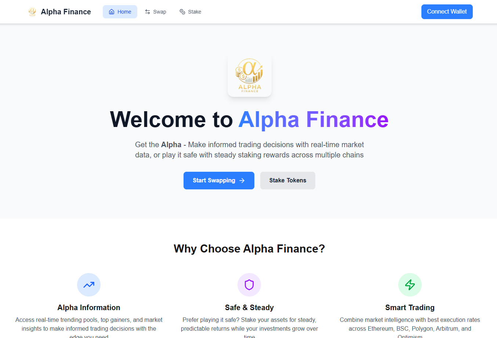

# Alpha Finance

> A comprehensive DeFi platform offering token swapping, staking, and yield farming across multiple protocols.

Alpha Finance integrates with AAVE, Compound, and 1inch to provide users with optimal trading routes and staking opportunities across Ethereum and other supported networks. Built with Next.js and Web3 technologies for seamless decentralized finance interactions.

https://github.com/ShaunLim08/alpha-finance.git



## Table of Contents

- [Features](#features)
- [Quick Start](#quick-start)
- [Usage Guide](#usage-guide)
- [Technical Architecture](#technical-architecture)
- [Development](#development)
- [API Documentation](#api-documentation)
- [License](#license)

## Features

### 🔄 **Token Swapping**

- **1inch Integration**: Optimal swap routes across multiple DEXs
- **Best Rates**: Automatic price comparison and route optimization
- **Multi-chain Support**: Ethereum, BSC, Polygon, Arbitrum networks
- **Real-time Analytics**: Live market data and trading insights

### 💰 **Multi-Protocol Staking**

- **AAVE (LINK)**: Stake LINK tokens for competitive yields
- **Compound (USDC)**: Supply USDC for lending rewards
- **Compound (WETH)**: Stake wrapped ETH for passive income
- **Real-time APY**: Dynamic interest rates and yield tracking

### 📊 **Market Intelligence**

- **CoinGecko Integration**: Real-time price data and market analytics
- **Trending Pools**: Live liquidity pool performance tracking
- **Top Gainers/Losers**: Market movement insights
- **Portfolio Dashboard**: Comprehensive staking and trading overview

### 🔗 **Web3 Connectivity**

- **Universal Wallet Support**: 300+ wallets via ReOwn (WalletConnect)
- **Secure Transactions**: End-to-end encryption and permission management
- **Mobile Friendly**: QR code and deep link integration
- **Session Management**: Persistent connections and auto-reconnection

## Quick Start

### Prerequisites

- Node.js 16+
- npm or yarn
- Web3 wallet (MetaMask recommended)

### Installation

1. **Clone the repository:**

   ```bash
   git clone https://github.com/ShaunLim08/alpha-finance.git
   cd alpha-finance
   ```

2. **Install dependencies:**

   > **Note**: We provide all packages separately because `npm install` was not working for us. You can try the individual installations below or use the alternative command at the end.

   **Core Framework & React:**

   ```bash
   npm install next@15.4.3
   npm install react@19.1.0 react-dom@19.1.0
   ```

   **Web3 & Wallet Integration:**

   ```bash
   npm install @rainbow-me/rainbowkit@2.1.0
   npm install wagmi@2.16.0
   npm install viem@2.33.0
   npm install ethers@6.15.0
   ```

   **UI & Styling:**

   ```bash
   npm install @vanilla-extract/css@1.14.0 @vanilla-extract/sprinkles@1.6.1
   npm install framer-motion@12.23.11
   npm install lucide-react@0.525.0
   npm install qrcode.react@4.2.0
   ```

   **Data Management:**

   ```bash
   npm install @tanstack/react-query@5.83.0
   ```

   **Development Dependencies:**

   ```bash
   npm install --save-dev eslint@9 eslint-config-next@15.4.3
   npm install --save-dev @eslint/eslintrc@3
   npm install --save-dev tailwindcss@4 @tailwindcss/postcss@4
   npm install --save-dev hardhat@2.26.1
   ```

   **Alternative: Install all at once**

   ```bash
   npm install
   ```

3. **(Example) Install Compound Finance Integration :**

   ```bash
   # Install Compound Finance Comet for USDC & WETH (if needed)
   npm install https://github.com/compound-finance/comet.git
   ```

4. **Environment Setup:**

   Copy the environment template:

   ```bash
   cp .env.example .env.local
   ```

   Configure your API keys in `.env.local`:

   ```env
   ONEINCH_API_KEY=your_1inch_api_key
   NEXT_PUBLIC_CHAIN_ID=1
   NEXT_PUBLIC_WALLETCONNECT_PROJECT_ID=your_walletconnect_project_id
   COINGECKO_API_KEY=your_coingecko_api_key
   COINGECKO_PRO_API_KEY=your_coingecko_pro_api_key
   ```

5. **Run the application:**

   ```bash
   npm run dev
   ```

6. **Open your browser:**
   Navigate to `http://localhost:3000`

### Required API Keys

| Service           | Purpose                    | Get Key                                                       |
| ----------------- | -------------------------- | ------------------------------------------------------------- |
| **1inch**         | Token swapping and routing | [1inch API Portal](https://portal.1inch.dev/)                 |
| **WalletConnect** | Web3 wallet integration    | [WalletConnect Cloud](https://cloud.walletconnect.com/)       |
| **CoinGecko**     | Market data and analytics  | [CoinGecko API](https://www.coingecko.com/en/api)             |
| **CoinGecko Pro** | Enhanced rate limits       | [CoinGecko Pro API](https://www.coingecko.com/en/api/pricing) |

## Usage Guide

### 🏠 **Home Page**

The landing page provides an overview of Alpha Finance's core capabilities:

- **Alpha Information**: Real-time trending pools and market insights
- **Safe & Steady**: Introduction to staking opportunities
- **Smart Trading**: Multi-chain trading capabilities showcase
- **Navigation**: Access to Swap, Stake, and Wallet connection

### 🔄 **Swap Interface**


**Token Swapping (Powered by 1inch):**

1. Connect your wallet using the "Connect Wallet" button
2. Select tokens to swap from the dropdown menus
3. Enter the amount you want to swap
4. Review the optimal route and gas fees
5. Approve the transaction in your wallet
6. Execute the swap

**Market Analytics:**

- **Trending Pools**: Monitor high-performance liquidity pools
- **Top Gainers/Losers**: Track market movements in real-time
- **Volume & TVL Data**: Analyze trading volumes and total value locked

### 💰 **Staking Dashboard**


**Staking Protocols:**

#### AAVE (LINK Token)

- **APY**: Dynamic rates from AAVE protocol
- **Actions**: Stake/Withdraw LINK tokens
- **Tracking**: Real-time balance and yield monitoring

#### Compound (USDC Token)

- **APY**: Real-time Compound lending rates
- **Actions**: Supply/withdraw USDC with cUSDC management
- **Features**: Automatic interest compounding

#### Compound (WETH Token)

- **APY**: Dynamic WETH lending rates
- **Actions**: Supply/withdraw WETH with cWETH handling
- **Benefits**: Use as collateral for borrowing

**Portfolio Overview:**

- **Total Staked**: Aggregated value across all protocols
- **Total Earned**: Combined yield from all positions
- **Individual Tracking**: Per-token balances and USD values

### 🔗 **Wallet Connection**

**Supported Wallets:**

- **Browser Extensions**: MetaMask, Coinbase Wallet, Brave Wallet
- **Mobile Wallets**: Trust Wallet, Rainbow, Argent, imToken
- **Hardware Wallets**: Ledger, Trezor integration
- **WalletConnect**: Universal protocol support for 300+ wallets

**Connection Features:**

- **QR Code**: Mobile wallet connection via scanning
- **Deep Links**: Direct wallet app launching
- **Session Management**: Persistent connections across sessions
- **Auto-reconnection**: Automatic wallet reconnection on app restart

## Technical Architecture

### 🏗️ **Solution Architecture**


The diagram above illustrates the complete technical stack and data flow of Alpha Finance, showing how users interact with DeFi protocols through our application layer.

### 🏗️ **Frontend Stack**

- **Framework**: Next.js with React
- **Styling**: Tailwind CSS / Custom CSS
- **Web3**: ReOwn (WalletConnect) integration
- **State Management**: React Context and hooks

### 📱 **Application Structure**

#### Core Pages

- **`index.js`**: Home page with feature overview
- **`swap.js`**: Trading interface with 1inch integration
- **`stake.js`**: Multi-protocol staking dashboard
- **`_app.js`**: Global layout and provider setup

#### Key Components

- **`SwapPlatform.js`**: Main token swap interface
- **`PoolCards.js`**: Market data and pool statistics
- **`aavestakingcard.js`**: AAVE LINK staking component
- **`compoundstakingcard.js`**: Compound USDC staking component
- **`wethcompoundstakingcard.js`**: Compound WETH staking component

### 🔗 **API Integration**

#### 1inch API

- **Swap Routes**: Optimal path finding across DEXs
- **Token Listings**: Available tokens and metadata
- **Price Quotes**: Real-time exchange rates
- **Transaction Execution**: Swap confirmation handling

#### CoinGecko API

- **Price Data**: Real-time token pricing
- **Market Analytics**: Volume, market cap, trends
- **Historical Data**: Price charts and trading history
- **Pool Information**: DeFi liquidity pool statistics

### 🗂️ **Project Structure**

```
alpha-finance/
├── components/           # React components
├── pages/               # Next.js pages
│   ├── api/            # API routes
│   ├── index.js        # Home page
│   ├── swap.js         # Swap interface
│   └── stake.js        # Staking dashboard
├── contracts/          # Smart contracts
├── public/            # Static assets
└── styles/            # CSS files
```

## Development

### 🔧 **Smart Contract Development**

#### Contract Overview

**MarketInteractions.sol**

- **AAVE Integration**: LINK token staking through AAVE lending pools
- **Yield Optimization**: Automated lending position management
- **Rewards Collection**: Staking reward distribution automation

**Compound USDC Supplier**

- **USDC Lending**: Supply USDC tokens to Compound protocol
- **cUSDC Management**: Handle minting and redeeming of cUSDC tokens
- **Interest Compounding**: Automatic yield accumulation

**Compound WETH Supplier**

- **WETH Lending**: Supply wrapped ETH for yield generation
- **cWETH Management**: Manage cWETH token positions and redemptions
- **Collateral Usage**: Enable WETH as borrowing collateral

#### Contract Deployment

1. **Compile contracts:**

   ```bash
   npx hardhat compile
   ```

2. **Configure network settings** in `hardhat.config.js`

3. **Deploy to network:**
   ```bash
   npx hardhat deploy --network [network-name]
   ```

#### Contract Addresses

**Sepolia Testnet (Verified Contracts):**

- **MarketInteractions (AAVE LINK)**: [`0x19ab1aBC4B4e5d6A114297ec23969773b9a5736D`](https://sepolia.etherscan.io/address/0x19ab1aBC4B4e5d6A114297ec23969773b9a5736D)
- **Compound USDC Supplier**: [`0x5557270F0628369A7E1Fc44F7b0Bb63dD603d34e`](https://sepolia.etherscan.io/address/0x5557270F0628369A7E1Fc44F7b0Bb63dD603d34e)
- **Compound WETH Supplier**: [`0xd891831C0F7034545d55E538265749136720FAC6`](https://sepolia.etherscan.io/address/0xd891831C0F7034545d55E538265749136720FAC6)

**Token Addresses (Verify before use):**

- **USDC**: `0x1c7D4B196Cb0C7B01d743Fbc6116a902379C7238`
- **WETH**: `0x2D5ee574e710219a521449679A4A7f2B43f046ad`
- **ChainLink**: `0xf8Fb3713D459D7C1018BD0A49D19b4C44290EBE5`
- **aLink Pool Token**: `0x3FfAf50D4F4E96eB78f2407c090b72e86eCaed24`

### 📁 **Public Assets**

The `/public` directory contains:

- **Logo Files**: Alpha Finance branding assets
- **Screenshots**: Application interface documentation images
- **Token Icons**: Protocol and cryptocurrency logos
- **Optimized Images**: Compressed assets for fast loading

## API Documentation

### 🛠️ **API Endpoints**

#### `/api/approve`

- **Purpose**: Handle 1inch swap approval transactions
- **Function**: Set token spending permissions for swap contracts
- **Features**: Gas optimization and approval management

#### `/api/swap`

- **Purpose**: Execute token swaps via 1inch protocol
- **Function**: Process swap transactions with optimal routing
- **Features**: Route optimization and transaction confirmation

#### `/api/tokens`

- **Purpose**: Retrieve available tokens for swapping
- **Function**: Fetch token metadata and contract addresses
- **Features**: Support for multiple networks and token standards

#### `/api/coingecko`

- **Purpose**: Fetch cryptocurrency market data
- **Function**: Real-time pricing and market analytics
- **Features**: Historical data and trading volume information

### 📊 **Data Sources**

- **1inch API**: DEX aggregation and swap routing
- **CoinGecko API**: Market data and price feeds
- **GeckoTerminal**: DeFi pool analytics and trending data

## License

This project is licensed under the MIT License - see the LICENSE file for details.

---

**⚠️ Disclaimer**: This software is for educational and research purposes. Always verify smart contract addresses and conduct thorough testing before using with real funds. DeFi protocols carry inherent risks including smart contract vulnerabilities and market volatility.
